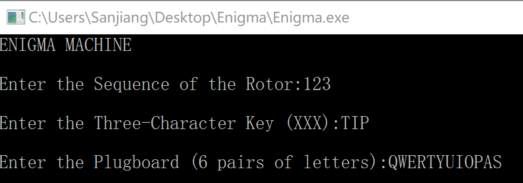
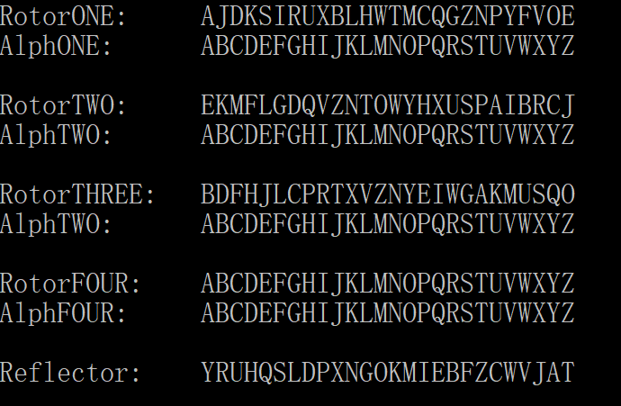
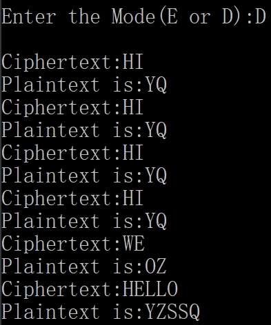
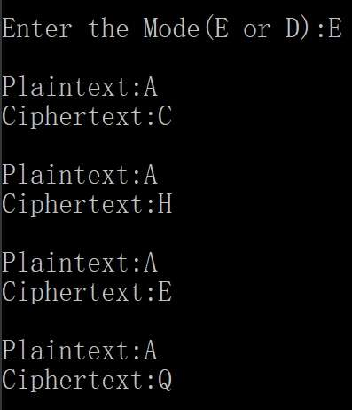

Enigma
======
***
### This is a simulator of `Enigma Machine` which is a kind of mechanical cipher used by Germany army in the WW2.
***

## Content
* [Getting_Started](#getting_started)
* [Run_Enigma](#run_enigma)
    * Basic Function
    * Special Feature  
    * Reminder
* [Main](#main)
* [Rotor](#rotor)
* [Rotorgroup](#rotorgroup)
* [Setting](#setting)

***
## Getting_Started
### Prerequisites
* For Windows 7+  **ONLY**
* DEV C++ 5.11(for editing)

### Installing  
If you haven't installed DEV C++ on your computer, here is the URL link to [Download DEV C++](https://sourceforge.net/projects/orwelldevcpp)

***
## Run_Enigma
### Basic Function
To use the `Enigma simulator`, you just have to `double click` the `Enigma.exe`  
A terminal-like window will appear with output as followed:
```
ENIGMA MACHINE

Enter the Sequnce of the Rotor:
```
As most of other ciphers, `Enigma` requires key to encrypt and and decrypt messages  
I am simulating an early version of `Enigma` which has three keys:
* The Sequence of `Rotors`: A **three-digit number** made up of `1` `2` `3`
* The initial position of each `Rotor`: **Three English letters**
* The settings of `Plugboard`: **Six pairs of letters**

There is no need for you to know all the theories and processes behind the mechanism of `Enigma Machine`. If you are interested, you can go to [this website](http://enigma.louisedade.co.uk/howitworks.html) for more information



This is a sample setting for `Enigma Machine`. You can use any valid combination you like.  
After entering the keys, the arrangements of all the `Rotors` will be printed on the window:  
<div><align = center></div>

This is just for visual effect and debug. You can simply ignore it.
```
Enter the Mode(E or D):
```
There are two mode to chose from:  
* **`Mode E`** means en/decrypting only one letter at a time, making it more realistic comparing with the real machine.



* **`Mode D`** means en/decrypting one sentence at a time. However, all the `rotors` will return to their original states once a sentence is en/decrepted.



***
### Special Feature
I used doubly linked lists to generate each `Rotor`. Every `unit` in those lists three pointers and one variable for letter:
```cpp
typedef struct Unit
{

  char letter;
  struct Unit* down;
  struct Unit* left;
  struct Unit* right;

}Unit;
```
Each `Rotor` also has an `Rotor Head` to mark the beginning:
```cpp
typedef struct Rotor_Head
{

  int length;
  Unit* down;

}pRotorhead;
```
By using doubly linked lists, the program can use resources of the computer with maximum efficiency.

***
### Reminder
* `Enigma Machine` **can't**  accept **`SPACE`**. It is ambiguous when sentences are too long.
* Only **English letters** is acceptable.

***
## Main
`main.c` contains all the inputs and outputs. However the most important part for en/decryption is as followed:
```cpp
ciphertext[i] = Plugboard(ciphertext[i], plugboard);
ciphertext[i] = Encrytion(ciphertext[i], key, seq);
ciphertext[i] = Plugboard(ciphertext[i], plugboard);

ptext[i] = ciphertext[i];
key = KeyRotation(key);
```
This imitate the electric currents inside the real Enigma Machine.
```
Plugboard ---> Rotors ---> Plugboard ---> Rotation
```

***
## Rotor
`rotor.c` includes all the function for doubly linked list operations:
```cpp
pRotorhead* CreateRotor ();

int Size_of_Rotor (pRotorhead* pRotor);

int Insert_Unit (pRotorhead* pRotor,  char val);

Unit* Find (pRotorhead* pRotor, char val);

void Destroy (pRotorhead* pRotor);

void Print (pRotorhead* pRotor);
```

***
## Rotorgroup
`rotorgroup` is the core in this project. It includes all the algorithm `Enigma Simulation`:
```cpp
int ConnectRotor (pRotorhead* Alph_Rotor, pRotorhead* Ciph_Rotor, char Allet, char Cilet);  

void FillRotor ( pRotorhead* Ciph_Rotor, int num);

char Plugboard (char letter, char* plugboard);

char* KeyRotation (char* key);

char Encrytion (char dyletter, char* key, int seq);

void Printsetting (int seq);
```

***
## Setting
The sequence of letters in every `Rotor` and `Reflector` as fixed and are stored in `setting.h`:
```cpp
extern char RotorONE [27] = {"EOVFYPNZGQCMTWHLBXURISKDJA"};
extern char RotorTWO [27] = {"JCRBIAPSUXHYWOTNZVQDGLFMKE"};
extern char RotorTHREE [27] = {"OQSUMKAGWIEYNZVXTRPCLJHFDB"};
extern char RotorFOUR [27] = {"ZYXWVUTSRQPONMLKJIHGFEDCBA"};
extern char Reflector [27] = {"TAJVWCZFBEIMKOGNXPDLSQHURY"};
```
***
## This repo is now connect to slack

****

|Author|SkyL|
|---|---
|E-mail|2924312854@qq.com

****
